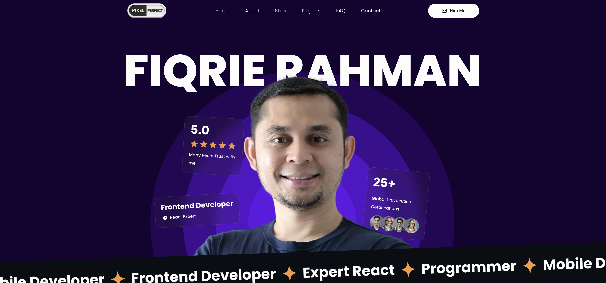

# Fiqrie's Portfolio — Front-End Engineer



<!-- Replace with your screenshot or a demo GIF -->

## 🌐 Live Demo

**Live Site:** [fiqrie-portfolio.vercel.app](https://fiqrie-portfolio.vercel.app/)

---

## 📖 Overview

This is my personal **Front-End Developer Portfolio**, built with **Next.js 14**, **TypeScript**, and **Tailwind CSS**. It showcases my skills, professional experience, and selected projects, along with reusable UI components and smooth page transitions for a modern, minimal design.

The portfolio is deployed on **Vercel** and optimized for performance, accessibility, and SEO.

---

## ✨ Features

* 🚀 **Next.js App Router** structure with dynamic routing
* 🎨 **Tailwind CSS** for responsive modern design
* 🧩 Modular architecture with reusable components
* 🧠 AI integration directory (future-ready)
* 📱 Fully responsive for desktop and mobile
* 💡 Clean, semantic TypeScript with ESLint and Prettier setup
* ⚙️ Deployed seamlessly to **Vercel**

---

## 🗂️ Project Structure

```
VETAPORTO/
├── .next/
├── public/
├── src/
│   ├── AI/                    # AI-related components (future integrations)
│   ├── app/
│   │   ├── api/              # API routes
│   │   ├── home/partials/    # Homepage UI sections
│   │   │   ├── black-band.tsx
│   │   │   ├── choose-me.tsx
│   │   │   ├── contact-form.tsx
│   │   │   ├── hero.tsx
│   │   │   ├── navbar.tsx
│   │   │   ├── footer.tsx
│   │   │   ├── projects.tsx
│   │   │   └── work-experience.tsx
│   │   ├── layout.tsx        # Main layout
│   │   ├── page.tsx          # Homepage
│   ├── components/
│   │   ├── profile-summary/  # About and skills sections
│   │   ├── work-experience/  # Career details
│   │   └── ui/               # Reusable UI components (buttons, dialogs, etc.)
│   │       ├── button.tsx
│   │       ├── form.tsx
│   │       ├── input.tsx
│   │       └── textarea.tsx
│   ├── styles/
│   │   └── globals.css       # Global styles
│   └── favicon.ico
└── README.md
```

---

## 🧠 Tech Stack

| Category             | Technology                                    |
| -------------------- | --------------------------------------------- |
| Framework            | [Next.js 14](https://nextjs.org/)             |
| Language             | [TypeScript](https://www.typescriptlang.org/) |
| Styling              | [Tailwind CSS](https://tailwindcss.com/)      |
| Deployment           | [Vercel](https://vercel.com/)                 |
| Linting & Formatting | ESLint + Prettier                             |

---

## 💼 Sections

* **Hero Section:** Introduction with a call-to-action.
* **About / Profile Summary:** Overview of experience, goals, and personal statement.
* **Professional Skills:** Visual list of technical proficiencies.
* **Projects:** Featured portfolio projects with descriptions and links.
* **Work Experience:** Company experience timeline.
* **Contact Form:** Interactive contact form with input validation.
* **Footer:** Quick links and contact info.

---

## 🛠️ Setup & Installation

1. **Clone the repository:**

```bash
git clone https://github.com/<your-username>/portfolio.git
cd portfolio
```

2. **Install dependencies:**

```bash
npm install
# or
yarn install
```

3. **Run the development server:**

```bash
npm run dev
```

4. **Open in browser:**

```
http://localhost:3000
```

---

## 📸 Screenshots / Demo

Add your portfolio screenshots or GIFs here:

```
assets/
 ├── portfolio-screenshot.png
 └── portfolio-demo.gif
```

---

## 🚀 Deployment

Deployed with **Vercel**:

```bash
npm run build
vercel deploy
```

---

## 🧩 Future Improvements

* AI-powered resume generator integration (src/AI)
* Dark mode toggle
* CMS integration (e.g., Sanity or Contentlayer)
* Add analytics dashboard

---

## 🧑‍💻 Author

**Fiqrie**
Front-End Developer — passionate about building accessible, interactive web experiences.

🌐 [Portfolio](https://fiqrie-portfolio.vercel.app/)
🐙 [GitHub](https://github.com/vetacode)

---

## 🪪 License

MIT © 2025 Fiqrie
